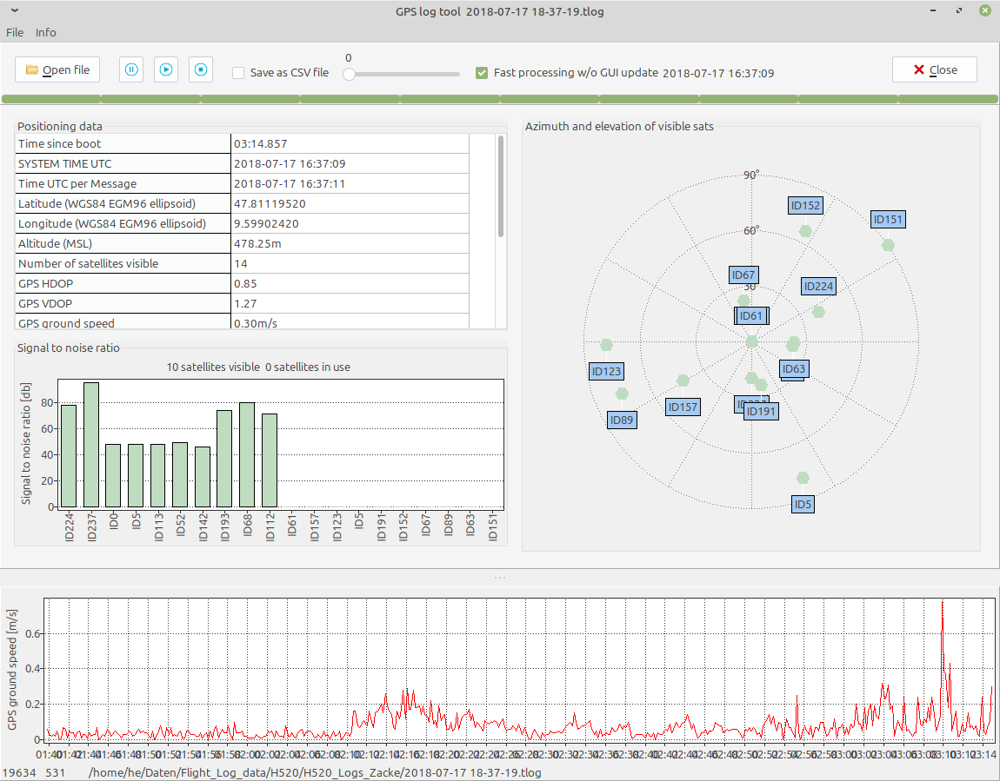

# GPS tool
GPStool is a tool that decodes MAVlink messages (aka Sensor files) from Yuneec drones. It may be the base for future specialized tool for different purposes to analyze sensor files.

**Usage**
---------
Usage is simple: Just load a *.TLOG, *.LOG or Sensor_xxxxx.bin file. Depending on the delay the messages will be decoded and displayed slow or faster.
The numeric result can be stored in a CSV file.
